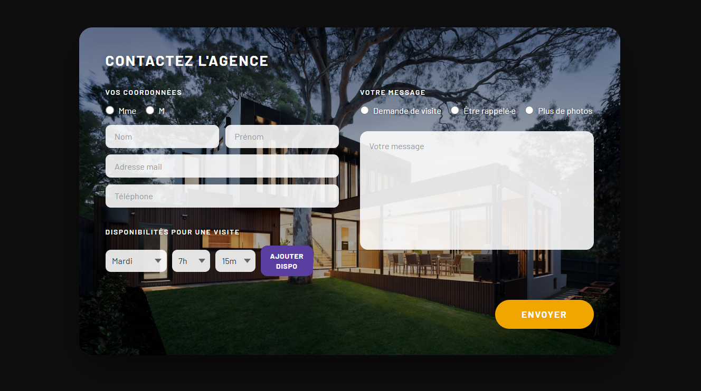

# Agence Immo — Formulaire de Contact


> Intégration d'une maquette de formulaire de contact pour une agence immobilière, avec sauvegarde des données en base de données.

---

## À propos de moi

- **Nom / Prénom** : [Votre Nom] [Votre Prénom]
- **Niveau d'étude / formation en cours** : [Ex : Licence 3 Informatique / BUT Informatique / Master 1 Dev Web]
- **Durée de stage souhaitée** : [Ex : 6 mois — Avril à Septembre 2025]
- **Profils** :
  - GitHub : [https://github.com/votre-profil](https://github.com/votre-profil)
  - LinkedIn : [https://linkedin.com/in/votre-profil](https://linkedin.com/in/votre-profil)

---

## Screenshots

> Page principale du formulaire :



*(Remplacer par vos propres captures après lancement)*

---

## Stack technique & choix

| Outil | Version | Raison du choix |
|---|---|---|
| **Next.js** | 14 (App Router) | Framework React full-stack qui permet de co-localiser API routes et UI dans un seul projet, idéal pour ce type de formulaire avec persistance. |
| **TypeScript** | 5 | Typage statique qui prévient les erreurs à la compilation, indispensable pour la robustesse des données du formulaire et des appels API. |
| **Prisma** | 5 | ORM moderne avec auto-complétion, migrations et un schéma déclaratif très lisible — réduit le risque d'erreurs SQL et simplifie les évolutions du schéma. |
| **SQLite** | 3 | Base de données embarquée, zéro configuration, idéale pour un projet de démonstration. Facilement remplaçable par PostgreSQL en production. |
| **CSS Modules** | — | Scoping CSS natif à Next.js, évite les conflits de classes sans dépendance supplémentaire. |
| **Google Fonts** (Barlow + Cormorant) | — | Barlow pour la lisibilité des formulaires, Cormorant pour un ton luxueux cohérent avec l'immobilier haut de gamme. |

---

## Lancement du projet

### Prérequis

- Node.js >= 18
- npm ou yarn

### Installation

```bash
# 1. Cloner le dépôt
git clone https://github.com/votre-profil/agence-immo.git
cd agence-immo

# 2. Installer les dépendances
npm install

# 3. Configurer les variables d'environnement
cp .env.example .env
# DATABASE_URL="file:./dev.db" est déjà configuré pour SQLite

# 4. Créer la base de données et appliquer le schéma
npx prisma db push

# 5. Lancer le serveur de développement
npm run dev
```

Ouvrir [http://localhost:3000](http://localhost:3000)

### Commandes utiles

```bash
npm run dev        # Serveur de développement
npm run build      # Build de production
npm run start      # Lancer le build de production
npx prisma studio  # Interface visuelle pour explorer la base de données
```

### Voir les données soumises (Prisma Studio)

Les données des formulaires sont sauvegardées dans une base SQLite locale. Pour les consulter :

1. Laisser `npm run dev` tourner dans un terminal
2. Ouvrir un **nouveau terminal** dans le même dossier
3. Lancer :

```bash
npx prisma studio
```

4. Ouvrir [http://localhost:5555](http://localhost:5555) dans le navigateur
5. Cliquer sur la table **Contact** pour voir toutes les soumissions

### Variables d'environnement

Créer un fichier `.env` à la racine :

```env
DATABASE_URL="file:./dev.db"
```

---

## Structure du projet

```
agence-immo/
├── src/
│   ├── app/
│   │   ├── api/
│   │   │   └── contact/
│   │   │       └── route.ts      # API POST + GET contacts
│   │   ├── globals.css
│   │   ├── layout.tsx
│   │   └── page.tsx
│   ├── components/
│   │   ├── ContactForm.tsx       # Composant principal du formulaire
│   │   └── ContactForm.module.css
│   └── lib/
│       └── prisma.ts             # Singleton Prisma Client
├── prisma/
│   └── schema.prisma             # Schéma de la BDD
├── .env
└── package.json
```

---

## API

### `POST /api/contact`

Enregistre une soumission de formulaire.

**Body JSON :**
```json
{
  "civilite": "Mme",
  "nom": "Dupont",
  "prenom": "Marie",
  "email": "marie@example.com",
  "telephone": "0612345678",
  "typeMessage": "visite",
  "message": "Je souhaite visiter le bien...",
  "disponibilites": [
    { "jour": "Lundi", "heure": 9, "minute": 30 }
  ]
}
```

**Réponse 201 :**
```json
{ "success": true, "id": 1 }
```

### `GET /api/contact`

Retourne tous les contacts enregistrés (ordre décroissant).

---

## Questions

**Avez-vous trouvé l'exercice facile ou difficile ? Qu'est-ce qui vous a posé problème ?**

L'exercice était de difficulté intermédiaire. La partie la plus délicate a été de reproduire fidèlement la maquette tout en la rendant fonctionnelle : la gestion des disponibilités (ajout/suppression de créneaux sous forme de tags) et l'alignement précis des deux colonnes avec le fond en image. L'intégration de Prisma avec Next.js App Router (Server vs Client Components) a aussi demandé de bien clarifier les frontières.

**Avez-vous appris de nouveaux outils pour répondre à l'exercice ? Si oui, lesquels ?**

J'ai approfondi ma maîtrise de **Next.js App Router** (notamment les Route Handlers pour l'API) et de **Prisma** avec SQLite. L'utilisation des **CSS Modules** avec des variables CSS pour reproduire une maquette avec précision m'a aussi permis d'affiner ma méthode d'intégration.

**Quelle est la place du développement web dans votre cursus de formation ?**

Le développement web occupe une place centrale dans ma formation. [Compléter avec votre situation — ex : "J'ai suivi X modules de développement front et back, avec des projets en React, Node.js et bases de données relationnelles."]

**Avez-vous utilisé un LLM ? Si oui, comment intégrez-vous les LLMs à chaque étape de votre workflow ?**

Oui, j'ai utilisé Claude (Anthropic) comme assistant. Mon workflow : 
1. **Analyse** — je lis l'exercice seul et identifie les points techniques clés
2. **Architecture** — je décide de la structure du projet (App Router, Prisma, CSS Modules) de manière autonome
3. **Génération** — j'utilise le LLM pour accélérer l'écriture du code boilerplate (schéma Prisma, types TypeScript) et pour débloquer des problèmes précis
4. **Review** — je relis et comprends tout le code généré avant de le valider, je l'adapte si besoin
5. **Documentation** — j'utilise le LLM pour structurer le README en m'assurant que toutes les sections requises sont couvertes

L'objectif est de garder la maîtrise technique tout en gagnant en vitesse d'exécution.
